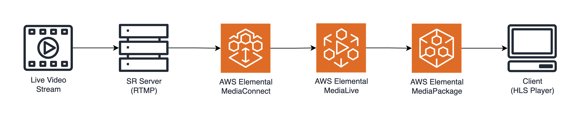
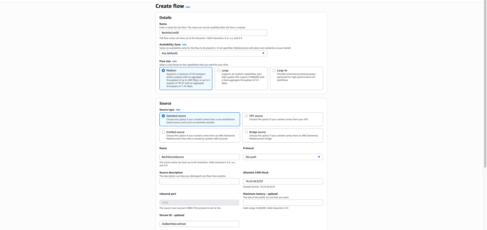
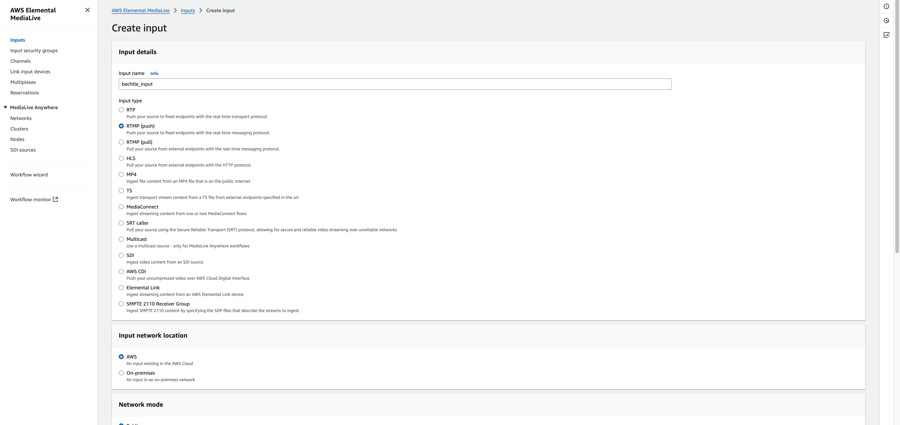
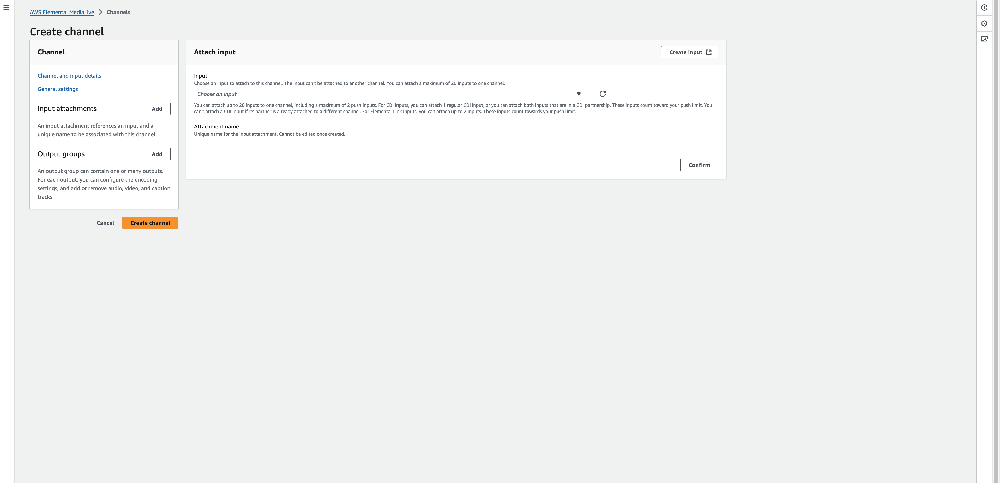
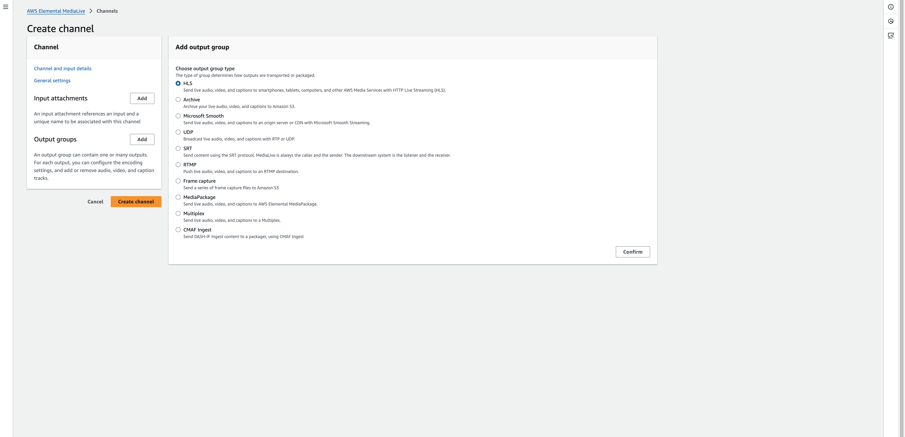
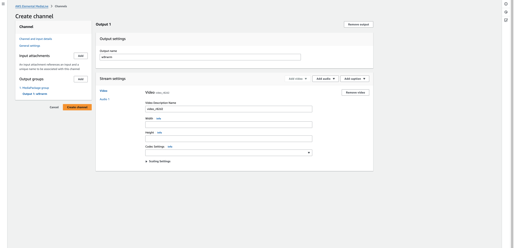
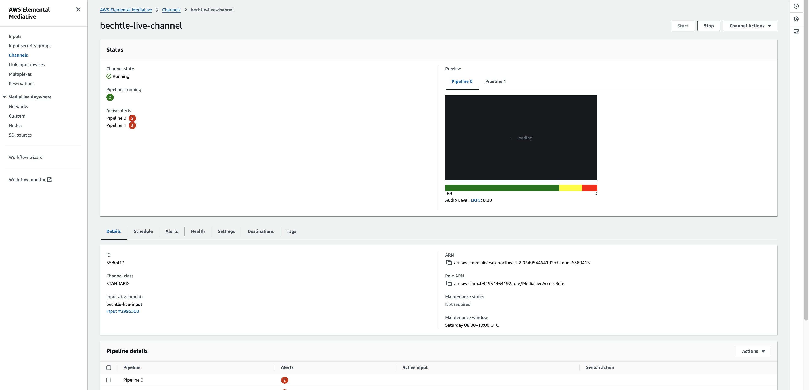

# Use case A : MediaConnect <-> Bluewhale-VSR <-> MediaLive

Receive low-bitrate feeds from external contribution networks (OB vans, studios), perform real-time restoration and upscaling using the Bluewhale-VSR AMI, and then encode & package them into ABR format with AWS Elemental MediaLive for delivery to viewers.

## Architecture

 

 

## Prerequisites

## Workflow

### 1. Create a MediaConnect Flow

#### 1.1 Access AWS Elemental MediaConnect

Before you can use AWS Elemental MediaConnect, you need an AWS account and the appropriate permissions to access, view, and edit MediaConnect components. For detailed information, see [Setting up AWS Elemental MediaConnect](https://docs.aws.amazon.com/ko_kr/mediaconnect/latest/ug/setting-up.html).

After you set up your AWS account and create IAM roles, go to the MediaConvert console.

#### 1.2 Create a flow

1. On the **Flows** page, choose **Create flow**.
2. **Details**: Name → `BechtleLiveSR`, Availability Zone → `Any`
3. **Source**:

- Source type → `Standard source`
- Name → `BechtleLiveSource`
- Protocol → `Zixi push` (ingest port auto-assigned)
- Stream ID → `ZixiBechtleLiveFeed`
- Allowlist CIDR → `10.24.34.0/23`

4. Choose **Create flow**

 

 

### 1.3 Add an output

### 2. Run Bluewhale AMI

### 3. MediaPackage channel configuration

### 3. MediaLive channel configuration

Before you can use MediaLive, you need an AWS account and the appropriate permissions to access, create, and view MediaLive components. For detailed information, see [Preliminary steps for setting up to use MediaLive](https://docs.aws.amazon.com/medialive/latest/ug/setting-up.html).

1. On the **Inputs** page, choose **Create input**.

- **Input details** : Input name -> `bechtle_input`, Input type -> `RTMP(push)`
- **Input security group** : Choose `0.0.0.0/0`
- Choose **Create input**.

 

 

3. On the **Channels** page, choose **Create channel**.

- **General info** : Channel name -> `bechtle-live-channel`
- **Input attachments**
  - Choose **Add**
  - **Attach input**: Input -> Select `bechtle_input`
  - Choose **Confirm**
- **Output groups** : Add output group -> `MediaPackage`
- **MediaPackage group**
  - **MediaPackage destination** : `Use HLS output`, MediaPackage channel group name -> `mpkg-channel-bechtle`
  - **MediaPackage outputs**
    - Choose `Settings`
    - Video: Width -> `1280`, Height -> `720`, Codec Setting -> `H264`
    - Aspect Rato > PAR Control -> `SPECIFIED`, PAR Numerator -> `1`, PAR Dominator -> `1`
    - Frame Rate > Framerate Control -> `SPECIFIED`, Framerate Numerator -> `30`, Framerate Deniminator -> `1`
- Choose **Create channel**.

 

 

 

 

 

 

### 4. Create MediaLive Input

- In the navigation pane, choose **Channels**, and then on the **Channels** page, choose the channel that you want to start.
- Click **Start**. The channel state will change to either Starting or Running.
- After a few seconds, the thumbnail preview of the current input appears (if thumbnail preview is enabled).

 

 

### 5. MediaPackage 입력 생성

### 6. Verify Output
