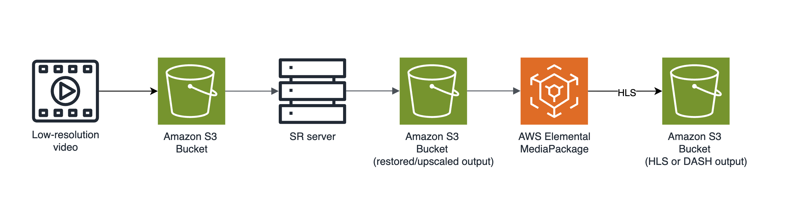
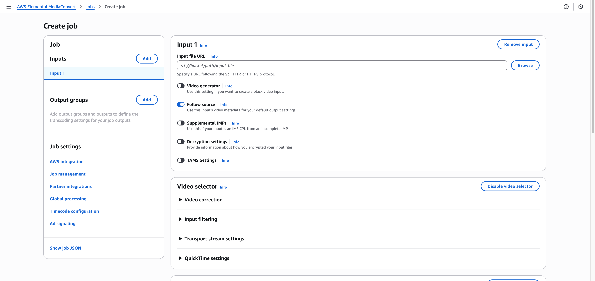
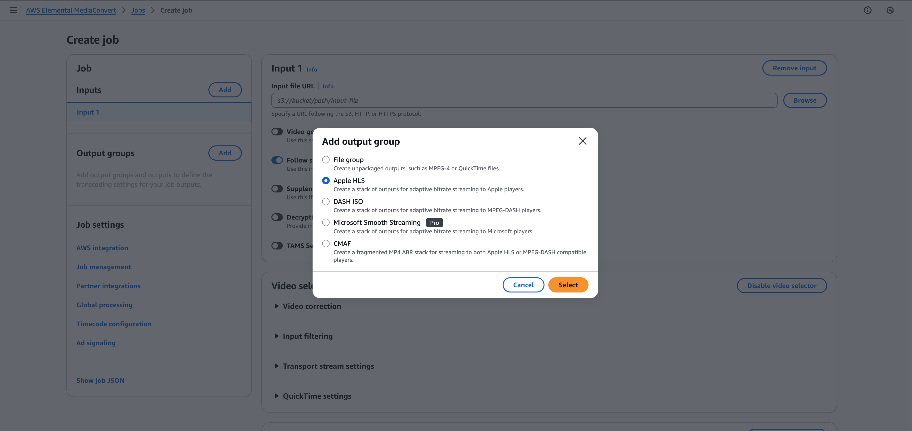
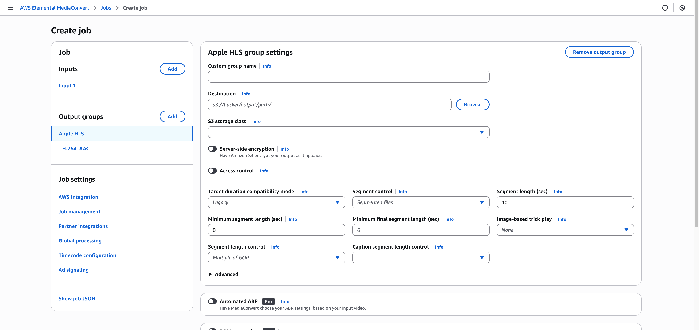
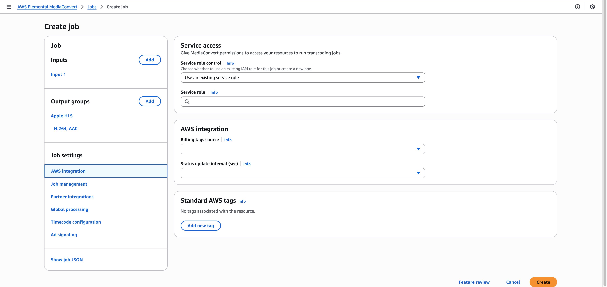

# Use case B : S3 -> Bluewhale-VSR AMI -> MediaConvert

This use case describes the complete process of upscaling low-resolution videos uploaded to AWS S3 using the Bechtle-VSR AMI. and then packaging them into HLS/DASH formats via AWS Elemental MediaConvert for distribution as Video on Demand(VOD).

## Architecture

<br/>

<br/>

## Prerequisites

- AWS account
- Three AWS S3 bucket : original, upscaled output, hls/dash output
- IAM role with the correct permission (For detailed information, see [IAM role]())

## Workflow

### 1. Upload Source File

Upload the orignal low-quality video to the designated AWS S3 input bucket.

```bash
aws s3 cp original_input.mp4 s3://<s3-input-bucktet-name>/original_input.mp4
```

### 2. Run VSR Processing

From Lambda or Step Functions, send the processing command to the AMI using SSM Run Command.

```bash
ffmpeg -i original_input.mp4 -vf bdsr_aws=scale=2 -pix_fmt yuv420p -c:v libx264 upscaled_x2.mp4
```

### 3. Upload Processed Output

Save the restored/upscaled video to the AWS S3 output bucket.

```bash
aws s3 cp upscaled_x2.mp4 s3://<s3-output-bucktet-name>/upscaled_x2.mp4
```

### 4. Create MediaConvert Job

1. Go to the [Jobs](https://console.aws.amazon.com/mediaconvert/home#/jobs/list) page in the MediaConvert console.
2. Choose **Create job**.
3. Select **Input 1** pane, choose the desired file from the AWS S3 bucket.
   <br/>
   <br/>
   
   <br/>
4. After specifying the input, create an output group by selecting **Add** in the **Output groups** section. Then choose either **Apple HLS** or **DASH ISO**.
   <br/>
   <br/>
   
   <br/>
5. For **Destination**, specify the URI for the Amazon S3 location where the transcoding service will store your output files. You can specify the URI directly or choose **Browse** to select from your Amazon S3 buckets.
   <br/>
   <br/>
   
   <br/>
6. In **Job settings** section, choose **AWS integration**.  
   For **IAM role**, choose an IAM role that has permissions to access the Amazon S3 buckets that hold your input and output files.
   <br/>
   <br/>
   
   <br/>
7. Choose **Create** to start the job.

For detailed information on creating a MediaConvert job, see [Tutorial: Configuring job settings](https://docs.aws.amazon.com/mediaconvert/latest/ug/setting-up-a-job.html).

### 5. Verify Output

When the MediaConvert job is complete :

- Check the S3 output path for the `.m3u8`(HLS) or `.mpd` (DASH) file and the corresponding segments.
- Enter the playback URL into an HLS/DASH player (e.g., [hls.js demo](https://hlsjs.video-dev.org/demo)) to test video quality and seeking.
